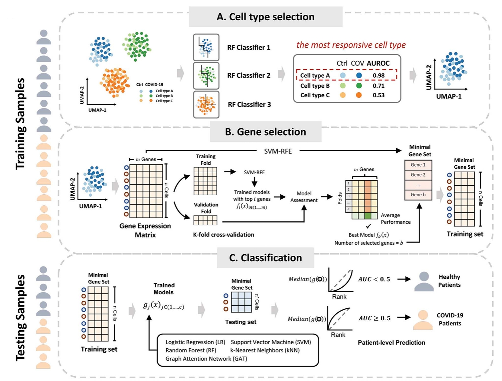

# scPanel

scPanel selects **a sparse gene panel** from responsive cell population(s) for **patient-level classification** in single cell RNA sequencing (**scRNA-seq**) data. 

This repository is the official code implementation of the paper [scPanel: a tool for automatic identification of sparse gene panels for generalizable patient classification using scRNA-seq datasets](https://academic.oup.com/bib/article/25/6/bbae482/7796623), published in *Briefings in Bioinformatics*.

### 🔬 Key Features

- Identify **cell populations** that are responding to the perturbation (e.g., disease, drugs)

- Selects a **minimal set of genes** that can discriminate two different status in the selected cell population(s)

- Trains **patient-level ML/DL classifiers** that can predict patients in two different status



Specifically, patients are split into training and testing sets. In the training set, cell populations responsive to perturbations are scored by quantifying how well each cell population is separated between two conditions. With the selected population, Support Vector Machine Recursive Feature Elimination (*SVM*-*RFE*) is applied to identify a minimal number of genes with high predictive power. The number of genes in the panel is automatically decided in a data-driven way to avoid bias from manual inspection. Using the selected cell population(s) and corresponding gene panel(s), scPanel constructs a patient-level classifier with the training data and evaluates its performance in the testing data to validate the power of identified genes. All the data splitting involved in scPanel is done at the patient level so that the importance of the selected cell population, genes, and the performance of corresponding classifiers are genearalizable to all patients.

### 💡 Why scPanel is better:

- **Cost-Effective**: Reduces the cost of sequencing with a small number of genes needed for assay

- **Automated**: Decides the number of genes in the panel automatically in a data-driven manner

- **Generalizable**: Ensures robust and transferable results by patient-level splitting and evaluation

- **Deep Learning Enabled**: Supports advanced deep classifiers, i.e., Graph Attention Networks (GATs), for capturing robust gene representations

- **Interoperable**: Fully compatible with Scanpy/Anndata framework

### ⚙️ Documentation
Documentation is being actively updated. Check the current version (23/08/2024) here:   
📘 [[scPanel Documentation]](https://scpanel.readthedocs.io/en/latest/autoapi/scpanel/index.html)

## Method Overview

scPanel follows a three-step pipeline:

1. Identify responsive cell population

2. Identify a sparse gene panel

3. Patient-level classification

## Usage

### 📦 Installation

You can install `scPanel` directly via pip:

```bash
pip install scpanel
```

### 🧬 Input scRNA-seq data

1. Quality control and preprocess data using standard workflow.

2. Annotate cell populations.

3. Input AnnData Object to scPanel.

### 🚀 Functions in scPanel

- `preprocess`(adata, ct_col, y_col, pt_col, class_map)
  
  - standardize metadata

- `split_train_test`(adata, out_dir, min_cells=20, min_samples=3, test_pt_size=0.2, random_state=3467, verbose=0)
  
  - split patients into 1) training set for cell type selection, gene panel identification, and classifiers training, 2) testing set to evaluate the performance of classifiers and validate the predictive power of the gene panel.

- `cell_type_score`(adata_train_dict, out_dir, ncpus, n_iterations, sample_n_cell, n_iterations=100, verbose=False)
  
  - calculate cell type responsive score (AUC) for each cell population annotated.

- `plot_cell_type_score`(AUC, AUC_all)
  
  - visualize cell type responsive score (AUC)

- `select_celltype`(adata_train_dict, out_dir, celltype_selected)
  
  - prepare anndata for gene panel selection

- `split_n_folds`(adata_train, nfold, out_dir=None, random_state=2349)
  
  - split data into multiple folds for gene selection

- `gene_score`(adata_train, train_index_list, val_index_list, sample_weight_list, metric, out_dir, ncpus, step=0.03, verbose = False)
  
  - scoring genes by their predictive power

- `decide_k`(adata_train, n_genes_plot=100)
  
  - automatically decide the number of genes selected for patient classification

- `plot_gene_score`(adata_train, n_genes_plot = 200, width=5, height=4, k=None)
  
  - visualize the gene score

- `select_gene`(adata_train, top_n_feat, out_dir=None, step=0.03, n_genes_plot=100, verbose=0)
  
  - select the top K (returned by `decide_k`) genes from the training set

- `transform_adata`(adata_train, adata_test_dict, selected_gene)
  
  - subset the training and testing set with the selected cell population and genes

- `models_train`(adata_train_final, search_grid, out_dir=None, param_grid=None)
  
  - train classifiers with LR, KNN, RF, SVM, GAT

- `models_predict`(clfs, adata_test_final, out_dir=None)
  
  - predict the probabilities of cells in the testing set

- `pt_pred`(adata_test_final, cell_pred_col = 'median_pred_score', num_bootstrap=None)
  
  - predict the patient label in the testing set

- `plot_roc_curve`(adata_test_final, sample_id, cell_pred_col, ncols = 4, hspace = 0.25, wspace = None, ax = None, scatter_kws = None, legend_kws = None)
  
  - visulize the aggregation of cell-level probabilities to patient-level label using area under the curve

- `plot_violin`(adata, cell_pred_col = 'median_pred_score', dot_size = 2, ax=None, palette=None, xticklabels_color=False, text_kws={})
  
  - visualize the patient-level prediction

## Citation

If you use `scPanel` in your work, please cite the `scPanel` publication:

Xie, Yi, et al. "scPanel: a tool for automatic identification of sparse gene panels for generalizable patient classification using scRNA-seq datasets." Briefings in Bioinformatics 25.6 (2024): bbae482.

```
@article{xie2024scpanel,
  title={scPanel: a tool for automatic identification of sparse gene panels for generalizable patient classification using scRNA-seq datasets},
  author={Xie, Yi and Yang, Jianfei and Ouyang, John F and Petretto, Enrico},
  journal={Briefings in Bioinformatics},
  volume={25},
  number={6},
  pages={bbae482},
  year={2024},
  publisher={Oxford University Press}
}
```
